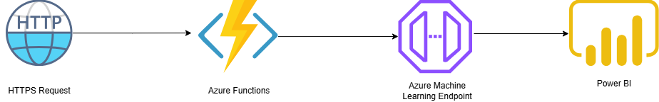

# Azure Functions Workflow for Machine Learning

This document describes the **Azure Functions workflow for invoking machine learning models** to generate real-time predictions and display insights using Power BI.

## **Architecture Overview**

Below is the high-level workflow for the Azure Functions ML pipelines:

### **Workflow Description:**

1. **HTTPS Request (Trigger):**
   - **Description:** The workflow begins with an HTTPS request, typically a REST API call made by a client or application.
   - **Purpose:** Sends input data to the Azure Function for processing.
   
2. **Azure Functions (Serverless Compute):**
   - **Description:** Azure Function is triggered by the HTTPS request to handle the business logic.
   - **Purpose:**
     - Preprocesses the input data.
     - Sends the data to an Azure Machine Learning endpoint for inference.
   
3. **Azure Machine Learning Endpoint (Model Inference):**
   - **Description:** An Azure Machine Learning service that hosts the deployed machine learning model.
   - **Purpose:** 
     - Receives input data and returns predictions based on the model.
     - Supports REST API-based real-time inference.

4. **Power BI (Visualization and Insights):**
   - **Description:** Displays the prediction results in a dynamic dashboard.
   - **Purpose:** 
     - Provides real-time visualizations of key performance indicators (KPIs).
     - Enables stakeholders to track and act upon ML-driven insights.

---

## **Use Cases:**
   - **Predictive Maintenance:** Real-time prediction of equipment failure.
   - **Anomaly Detection:** Identification of unusual patterns in data streams.
   - **Customer Behavior Analysis:** Real-time insights into customer interactions.
   - **Sales Forecasting:** Predicts future trends for business optimization.

---

## **Benefits of the Workflow:**
   - **Scalability:** Azure Functions automatically scale based on request volume.
   - **Cost-effectiveness:** Pay only for the execution time of Azure Functions.
   - **Integration:** Seamlessly integrates with Power BI for interactive dashboards and reports.
   - **Real-time Processing:** Supports real-time inference using Azure Machine Learning endpoints.

---

## **Sample Workflow Steps:**
1. **Send an HTTPS Request:** Input JSON data is sent to the Azure Function endpoint.
2. **Invoke Machine Learning Endpoint:** Azure Function sends the input to the Azure Machine Learning endpoint.
3. **Receive Predictions:** Azure ML endpoint returns the prediction as a JSON response.
4. **Display Results in Power BI:** The response is processed and visualized in a Power BI dashboard.

---

## **Setup Instructions:**
1. **Deploy Azure Function:** Create an HTTP-triggered Azure Function.
2. **Create Azure ML Endpoint:** Deploy the ML model as a REST endpoint in Azure.
3. **Connect Power BI:** Configure Power BI to visualize the output data.

## **Contributors:**
- [Ravikiran Bhonagiri]

## **License:**
This project is licensed under the MIT License. Feel free to modify and use it according to your requirements.
