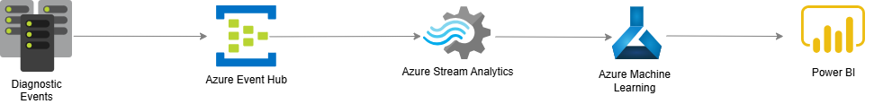

# Real-Time Data Analytics and Machine Learning Pipeline

This project demonstrates a **real-time data streaming and analytics solution** using Azure services for diagnostics and monitoring use cases.

## **Architecture Overview**

Below is the high-level architecture diagram for the pipeline:

The data pipeline follows these key steps:

### 1. **Diagnostic Events (Data Source)**
   - **Description:** Source of data events such as system telemetry, application logs, and IoT metrics.
   - **Purpose:** To collect real-time diagnostic data to monitor the system's health.

---

### 2. **Azure Event Hub**
   - **Description:** Acts as a high-throughput data ingestion service.
   - **Key Features:**
     - Handles large-scale event streams.
     - Supports real-time data ingestion from multiple sources.
   - **Purpose:** To serve as the entry point for streaming data.

---

### 3. **Azure Stream Analytics**
   - **Description:** Provides real-time stream processing and transformation of data.
   - **Key Features:**
     - SQL-like queries for data transformation, filtering, and aggregation.
     - Supports windowing, joining, and real-time alert generation.
   - **Purpose:** To preprocess data and generate insights in real time.

---

### 4. **Azure Machine Learning**
   - **Description:** Adds machine learning capabilities to the pipeline.
   - **Key Features:**
     - Supports pre-trained and custom models for predictions.
     - Enables anomaly detection and predictive maintenance.
   - **Purpose:** To perform real-time predictions and provide intelligent insights.

---

### 5. **Power BI (Visualization and Insights)**
   - **Description:** A business intelligence tool for real-time dashboards and visualizations.
   - **Key Features:**
     - Provides dynamic, interactive reports.
     - Supports near real-time data updates.
   - **Purpose:** To present actionable insights to business stakeholders.

---

## **Use Cases**
   - **System Monitoring:** Monitor key metrics such as CPU usage, memory, and errors.
   - **Predictive Maintenance:** Detect potential failures before they happen.
   - **Fraud Detection:** Identify anomalies in financial transactions.
   - **IoT Analytics:** Process sensor data for actionable insights.

## **Setup Instructions**
1. **Create Azure Event Hub:**
   - Set up an Azure Event Hub to receive diagnostic events.
   - Ensure you have the required connection strings.

2. **Configure Azure Stream Analytics:**
   - Define SQL-like queries for real-time transformations.
   - Input: Azure Event Hub.
   - Output: Azure Machine Learning and Power BI.

3. **Deploy Machine Learning Models:**
   - Train and deploy a machine learning model using Azure Machine Learning.
   - Link it to your Stream Analytics job for real-time inference.

4. **Set up Power BI Dashboard:**
   - Connect Power BI to your data stream.
   - Design real-time dashboards for data visualization.

---

## **Requirements**
- Azure Subscription.
- Power BI account.
- Python (optional for data preprocessing).
- Azure SDKs for local testing (if needed).

## **Contributors**
- [Ravikiran Bhonagiri]

## **License**
This project is licensed under the MIT License. You are free to modify and distribute it as per the license terms.

